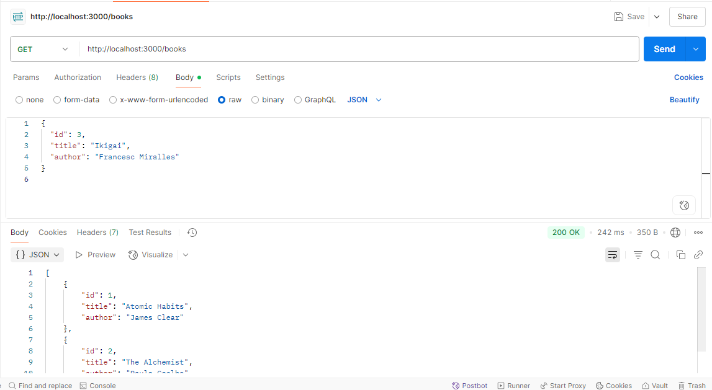
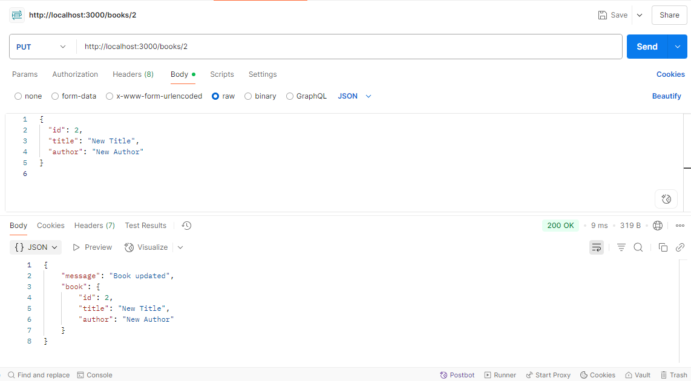
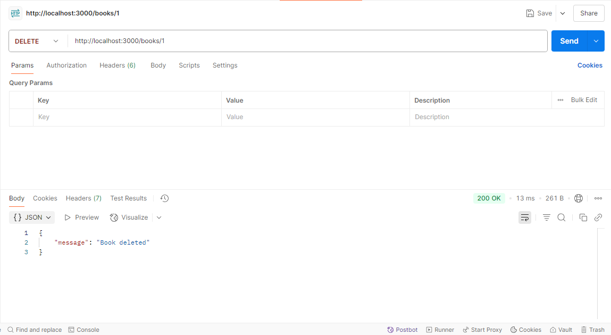

# 📚 Task 3 – Book Management REST API

This is a simple REST API built with **Node.js** and **Express.js** as part of a web development internship.  
The API allows you to perform basic **CRUD operations** on a list of books — stored in memory (no database).

---

## 🚀 Features

- **GET /books** – Get all books
- **POST /books** – Add a new book
- **PUT /books/:id** – Update an existing book by ID
- **DELETE /books/:id** – Delete a book by ID

---

## 💾 Sample Book Format

```json
{
  "id": 1,
  "title": "Atomic Habits",
  "author": "James Clear"
}

🧪 How to Run
Open the terminal in your project folder

Run npm install (installs Express)

Run node index.js

Open Postman and test the API at:

http://localhost:3000/books


## 📸 Screenshots

### ▶️ GET /books


### ✏️ PUT /books/:id


### ❌ DELETE /books/:id



📂 Folder Structure

book-api/
│
├── index.js          
├── package.json       
├── README.md          
└── images/            
    ├── screenshot-1.png
    ├── screenshot-2.png
    └── screenshot-3.png


 ✅Task Outcome

- This task helped understand:

  Express routing

- REST API concepts

- HTTP methods (GET, POST, PUT, DELETE)

- JSON handling

- Using Postman for testing